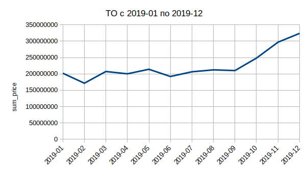
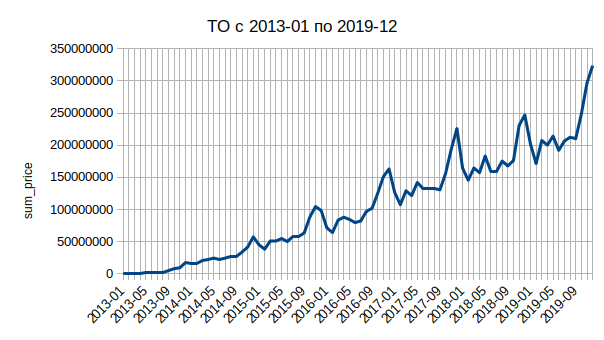

# Курсовой проект

## Задание

Надо спрогнозировать ТО по месяцам за 2019. В исходнике - все данные по продажам с 2013 года [orders_all](https://drive.google.com/drive/u/0/folders/1C3HqIJcABblKM2tz8vPGiXTFT7MisrML). Нужно учесть пробои данных, некорректность. Т.е. в некоторых месяцах проставить поправочные коэффициенты. Ваша задача - глубоко проанализировать, как развивался магазин, как менялись средние чеки, повторность продаж, тренд и сделать скорректирвоанный план на 2019 год по месяцам.
В качестве вывода: строите график ТО по месяцам за 2019 год и детально описываете, что учитывали для прогноза в pdf.

## Краткое описание проделанной работы

1. Из анализа были исключены невалидные данные с датой в виде `00.00.0000`.
2. Данные с отрицательной ценой были скорректированны, в столбце `price` сменили знак с минуса на плюс.
3. Данные с очень маленькой или нулевой ценой были оставлены.
4. Используя интерквартильный размах (IQ), из анализа были исключены данные с сильно завышенной ценой.
5. В результате фильтрации выбросов и не валидных данных было потеряно 9,11% информации.
6. Из анализа ТО были исключены первые 18 месяцев жизни магазина, так как они приводили к завышенным результатам.
7. Анализ динамики среднего чека был проведён по всему временному диапазону с 01.2013 по 12.2018
8. Результаты прогноза ТО и среднего чека на 2019 год:

| year_month | прогноз ТО     | средний чек |
| ---------- | -------------- | ----------- |
| 2019-01    | 201,955,941.02 | 1,540.78    |
| 2019-02    | 171,465,618.67 | 1,554.45    |
| 2019-03    | 207,260,715.23 | 1,579.78    |
| 2019-04    | 200,201,007.17 | 1,551.65    |
| 2019-05    | 214,071,579.04 | 1,528.84    |
| 2019-06    | 192,035,446.23 | 1,537.67    |
| 2019-07    | 206,327,507.78 | 1,518.28    |
| 2019-08    | 212,301,819.67 | 1,520.77    |
| 2019-09    | 210,123,450.71 | 1,524.90    |
| 2019-10    | 248,189,887.31 | 1,562.22    |
| 2019-11    | 296,733,066.45 | 1,552.34    |
| 2019-12    | 323,614,786.55 | 1,564.85    |

Графики за 2019 год:




Графики за весь период анализа:




## Предобработка данных

Очистку данных делал с помощью `jupyter notebook`.

```python
import pandas as pd
import numpy as np
```

```python
DATASET_PATH = '../databases/orders_all.csv'
PREPARED_DATASET_PATH = '../databases/orders_all_prepared.csv'
RESULT_DATASET_PATH = '../databases/coursework.csv'
```

Загружаем данные и смотрим основные характеристики.

```python
df = pd.read_csv(DATASET_PATH, sep=";")
df.head()
```

| index | id_order | id_user | price | o_date     |
| ----- | -------- | ------- | ----- | ---------- |
| 0     | 129      | 1       | 1337  | 26.04.2013 |
| 1     | 130      | 155     | 182   | 26.04.2013 |
| 2     | 131      | 1       | 602   | 26.04.2013 |
| 3     | 132      | 1       | 863   | 26.04.2013 |
| 4     | 133      | 1       | 2261  | 26.04.2013 |

```python
df.info()
```

    <class 'pandas.core.frame.DataFrame'>
    RangeIndex: 4365731 entries, 0 to 4365730
    Data columns (total 4 columns):
    id_order    int64
    id_user     int64
    price       int64
    o_date      object
    dtypes: int64(3), object(1)
    memory usage: 133.2+ MB

```python
df.describe()
```

|       | id_order     | id_user      | price         |
| ----- | ------------ | ------------ | ------------- |
| count | 4.365731e+06 | 4.365731e+06 | 4.365731e+06  |
| mean  | 5.147334e+06 | 3.325856e+06 | 1.603399e+09  |
| std   | 3.509189e+06 | 3.011275e+06 | 3.350191e+12  |
| min   | 1.290000e+02 | 0.000000e+00 | -2.086000e+03 |
| 25%   | 1.812644e+06 | 5.880940e+05 | 7.340000e+02  |
| 50%   | 5.040464e+06 | 2.333255e+06 | 1.386000e+03  |
| 75%   | 8.403741e+06 | 5.422811e+06 | 2.496000e+03  |
| max   | 1.697058e+07 | 9.900289e+06 | 7.000000e+15  |

```python
df['id_order'].nunique()
```

    4365731

Пропусков в колонках `id_order` и `id_user` нет. Все записи в колонке `id_order` уникальные.

```python
initial_count = df.id_order.count()
initial_count
```

    4365731

```python
df.o_date.min()
```

    '00.00.0000'

Нашли явно не валидные данные.

```python
df.loc[df['o_date'] == '00.00.0000'].count()
```

    id_order    55492
    id_user     55492
    price       55492
    o_date      55492
    dtype: int64

```python
df.loc[df['o_date'] == '00.00.0000'].head()
```

| index   | id_order | id_user | price | o_date     |
| ------- | -------- | ------- | ----- | ---------- |
| 2136569 | 4900219  | 3764611 | 0     | 00.00.0000 |
| 2139866 | 4909909  | 3764611 | 0     | 00.00.0000 |
| 2139909 | 4910065  | 3764611 | 0     | 00.00.0000 |
| 2141378 | 4914559  | 3764611 | 0     | 00.00.0000 |
| 2141974 | 4916425  | 3764611 | 0     | 00.00.0000 |

```python
df.loc[(df['o_date'] == '00.00.0000') & (df['price'] == 0)].count()
```

    id_order    55492
    id_user     55492
    price       55492
    o_date      55492
    dtype: int64

Видим что в записях с невалидной датой цена везде равна нулю. Так что эти данные можно отбросить.

```python
df.drop(df[(df['o_date'] == '00.00.0000')].index, inplace=True)
```

```python
df.o_date.min()
```

    '01.01.2014'

```python
df.o_date.max()
```

    '31.12.2017'

Поменяем тип данных для колонки `o_date`.

```python
df['o_date'] = pd.to_datetime(df['o_date'])
```

```python
df.info()
```

    <class 'pandas.core.frame.DataFrame'>
    Int64Index: 4310239 entries, 0 to 4363046
    Data columns (total 4 columns):
    id_order    int64
    id_user     int64
    price       int64
    o_date      datetime64[ns]
    dtypes: datetime64[ns](1), int64(3)
    memory usage: 164.4 MB

```python
df.o_date.min()
```

    Timestamp('2013-01-08 00:00:00')

```python
df.o_date.max()
```

    Timestamp('2018-12-27 00:00:00')

Теперь избавимся от невалидных данных в колонке `price`.

```python
df.describe()
```

|       | id_order     | id_user      | price         |
| ----- | ------------ | ------------ | ------------- |
| count | 4.310239e+06 | 4.310239e+06 | 4.310239e+06  |
| mean  | 5.113639e+06 | 3.319858e+06 | 1.624042e+09  |
| std   | 3.511263e+06 | 3.030090e+06 | 3.371688e+12  |
| min   | 1.290000e+02 | 0.000000e+00 | -2.086000e+03 |
| 25%   | 1.780412e+06 | 5.694485e+05 | 7.540000e+02  |
| 50%   | 4.959950e+06 | 2.263972e+06 | 1.400000e+03  |
| 75%   | 8.376397e+06 | 5.468550e+06 | 2.518000e+03  |
| max   | 1.098539e+07 | 9.900289e+06 | 7.000000e+15  |

Для отрицательных значений поменяем знак.

```python
df[df['price'] <= 0].count()
```

    id_order    54
    id_user     54
    price       54
    o_date      54
    dtype: int64

```python
df.loc[df['price'] < 0, 'price'] = df.loc[df['price'] < 0, 'price'] * -1
```

В колонке с ценой есть как нулевые данные, так и явные выбросы. Применим интерквартильный размах чтобы избавиться от выбросов.

```python
IQ=df.price.describe()['75%']-df.price.describe()['25%']
low_border=df.price.describe()['25%']-IQ*1.5
high_border=df.price.describe()['75%']+IQ*1.5
```

```python
print(IQ,low_border,high_border)
```

    1764.0 -1892.0 5164.0

```python
df.loc[df['price'] > high_border, 'price'].count()
```

    342583

Нижняя граница получилась отрицательной, так что избавиться от нулевых данных таким образом не получится. Сперва я приравнял выбросы значений колонки `price` сверху и снизу (заказ менее 50 рублей) к медианному значению. Но потом решил что заказы в 0 рублей вполне могут быть. Например, если клиенту дали 100% скидку за ошибку магазина или не качественный сервис. Так же решил выкинуть данные с выбросами сверху. В конце проверим, какой процент данных мы потеряем.

```python
df.drop(df[(df['price'] > high_border)].index, inplace=True)
```

Посмотрим, что у нас получилось.

```python
df.describe()
```

|       | id_order     | id_user      | price        |
| ----- | ------------ | ------------ | ------------ |
| count | 3.967656e+06 | 3.967656e+06 | 3.967656e+06 |
| mean  | 5.105578e+06 | 3.306019e+06 | 1.562793e+03 |
| std   | 3.517659e+06 | 3.033508e+06 | 1.125650e+03 |
| min   | 1.290000e+02 | 0.000000e+00 | 0.000000e+00 |
| 25%   | 1.766375e+06 | 5.593480e+05 | 7.100000e+02 |
| 50%   | 4.928302e+06 | 2.237073e+06 | 1.272000e+03 |
| 75%   | 8.381790e+06 | 5.454628e+06 | 2.147000e+03 |
| max   | 1.098539e+07 | 9.900289e+06 | 5.164000e+03 |

Посмотрим на распределение цены заказа.

```python
df['price'].hist(alpha = 0.5, bins=50, density=True)
```

    <matplotlib.axes._subplots.AxesSubplot at 0x7f8bb39c1be0>


```python
result_count = df.id_order.count()
result_count
```

    3967656

```python
lost_percentage = (initial_count - result_count) * 100 / initial_count
lost_percentage
```

    9.118175169290092

Потери в 9% данных вполне приемлемы. Сохраним результат обработки данных в файл.

```python
df.to_csv(PREPARED_DATASET_PATH, index=False, encoding='utf-8')
```

### Группировка и выгрузка данных

Исходная задача такая: спрогнозировать ТО по месяцам за 2019.
Сгруппируем данные для анализа по дате заказа (год-месяц) и посчитаем сумму заказов по каждому периоду.

```python
df['year_month'] = pd.to_datetime(df['o_date']).dt.to_period('M')
```

```python
df.head()
```

| id_order | id_user | price | o_date     | year_month |
| -------- | ------- | ----- | ---------- | ---------- |
| 129      | 1       | 1337  | 2013-04-26 | 2013-04    |
| 130      | 155     | 182   | 2013-04-26 | 2013-04    |
| 131      | 1       | 602   | 2013-04-26 | 2013-04    |
| 132      | 1       | 863   | 2013-04-26 | 2013-04    |
| 133      | 1       | 2261  | 2013-04-29 | 2013-04    |

```python
result_df = df \
    .groupby('year_month') \
    .agg({'price': ['sum', 'mean']}) \
    .reset_index()
```

```python
result_df.head()
```

| year_month | sum_price | mean_price |
| ---------- | --------- | ---------- |
| 2013-01    | 1036657   | 1642.88    |
| 2013-02    | 1231875   | 1689.81    |
| 2013-03    | 1390532   | 1706.17    |
| 2013-04    | 1301414   | 1606.68    |
| 2013-05    | 1489346   | 1656.67    |

Выгрузим полученные результаты в файл и используем их для дальнейшего анализа.

```python
result_df.to_csv(RESULT_DATASET_PATH, index=False, encoding='utf-8')
```

### Анализ

Сперва рассчитываем коэффициенты тренда с помощью функции `LINEST`. Для первых 7-и месяцев 2013 года получаем отрицательные значения тренда. Это свидетельствует о том что фактически магазин получал прибыль, но относительно всего периода анализа (6 лет), в этот период магазин работал в убыток. Из графика видно, что в первые 7 месяцев роста почти не было, поэтому исключим первый год из анализ для более достоверного результата.

После перерасчёта тренда для периода с 2014-01, для первых 5-и месяцев 2014 года получаем отклонение тренда сильно больше среднего значения (от 1,29 до 2,7 при средних значениях от 1,03 до 1,31). Будем считать этот период фазой активного роста магазина и так же исключим эти 5 месяцев из анализа.

После перерасчёта тренда за период 2014-06 - 2018-12, на первый взгляд данные за 2015-11 сильно выбиваются из общей картины, но подсчёт разброса отклонения тренда по месяцам (разница между максимумом и минимумом для отклонения тренда) говорит о том, что это нормальное поведение для ноября:

| year_month | sum_price | отклонение тренда |
| ---------- | --------- | ----------------- |
| 2015-11    | 104616444 | 1.36944           |
| 2016-11    | 151046958 | 1.29458           |
| 2017-11    | 193709730 | 1.23414           |
| 2018-11    | 230696799 | 1.16962           |

Среднее отклонение тренда для ноября 1,24

Средние значения тренда и разброс отклонений тренда по месяцам:

| месяц    | среднее отклонение тренда | разброс отклонений тренда |
| -------- | ------------------------- | ------------------------- |
| январь   | 0.98591                   | 0.19342                   |
| февраль  | 0.82368                   | 0.12825                   |
| март     | 0.97983                   | 0.10172                   |
| апрель   | 0.93172                   | 0.05978                   |
| май      | 0.98105                   | 0.16100                   |
| июнь     | 0.92489                   | 0.36030                   |
| июль     | 0.91533                   | 0.28159                   |
| август   | 0.92847                   | 0.14522                   |
| сентябрь | 0.90590                   | 0.07226                   |
| октябрь  | 1.05495                   | 0.30177                   |
| ноябрь   | 1.24381                   | 0.21819                   |
| декабрь  | 1.33765                   | 0.22575                   |

Из таблицы видно что в июне разброс отклонения тренда достаточно большой (0,36). Присмотревшись, видим, что в 2014-06 отклонение тренда составило 1,15, в то время как для 2015-06, 2016-06, 2017-06 и 2018-06 оно меньше единицы. Это свидетельствует либо об продолжении актиивного роста магазина, либо об успешной рекламной акции в июне 2014. Так как это первый месяц рассматриваемого периода, исключим его из анализа.

Далее для периода 2014-07 - 2018-12 пересчитываем коэффициенты тренда. Явно выбивающихся из общей картины результатов нет. Считаем коэффициенты сезонности, очищенные от роста, рассчитываем тренд на 2019 год. Перемножаем коэффициенты сезонности, очищенные от роста со значениями тренда и получаем прогнозируемый ТО на 2019 год.

Аналогичным способоми анализируем данные по среднему чеку. В этих данных нет специфических знаений. За 6 лет средний чек почти не меняется и колеблется около 1500р. Так как за 6 лет инфляция не может быть 0%, это свидетельствует о снижении покупательской способности потребителя.

Подробные данные в файле `coursework.ods`.

Результаты прогноза:

| year_month | прогноз ТО     | средний чек |
| ---------- | -------------- | ----------- |
| 2019-01    | 201,955,941.02 | 1,540.78    |
| 2019-02    | 171,465,618.67 | 1,554.45    |
| 2019-03    | 207,260,715.23 | 1,579.78    |
| 2019-04    | 200,201,007.17 | 1,551.65    |
| 2019-05    | 214,071,579.04 | 1,528.84    |
| 2019-06    | 192,035,446.23 | 1,537.67    |
| 2019-07    | 206,327,507.78 | 1,518.28    |
| 2019-08    | 212,301,819.67 | 1,520.77    |
| 2019-09    | 210,123,450.71 | 1,524.90    |
| 2019-10    | 248,189,887.31 | 1,562.22    |
| 2019-11    | 296,733,066.45 | 1,552.34    |
| 2019-12    | 323,614,786.55 | 1,564.85    |

Графики за 2019 год:


Графики за весь период анализа:


