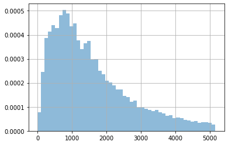
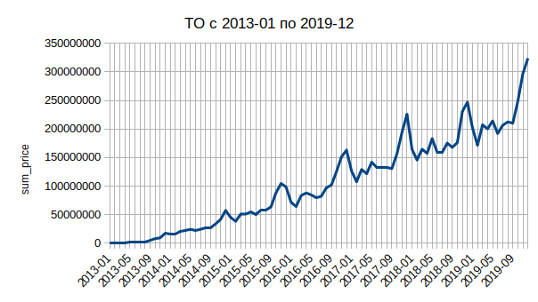
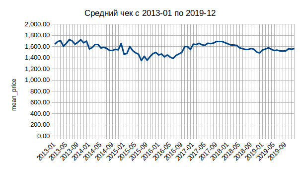
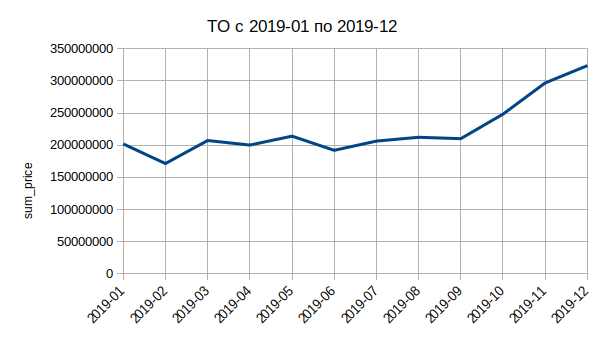
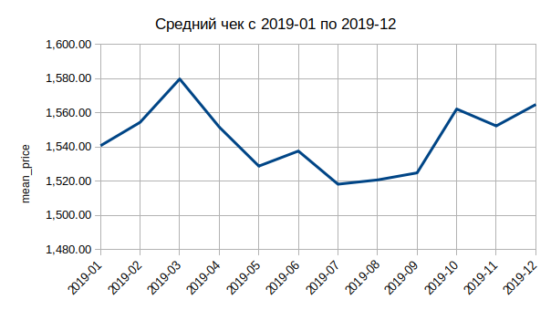

# Курсовой проект

## Задание

Надо спрогнозировать ТО по месяцам за 2019. В исходнике - все данные по продажам с 2013 года [orders_all](https://drive.google.com/drive/u/0/folders/1C3HqIJcABblKM2tz8vPGiXTFT7MisrML). Нужно учесть пробои данных, некорректность. Т.е. в некоторых месяцах проставить поправочные коэффициенты. Ваша задача - глубоко проанализировать, как развивался магазин, как менялись средние чеки, повторность продаж, тренд и сделать скорректирвоанный план на 2019 год по месяцам.
В качестве вывода: строите график ТО по месяцам за 2019 год и детально описываете, что учитывали для прогноза в pdf.

## Предобработка данных

Очистку данных делал с помощью `jupyter notebook`.

```python
import pandas as pd
import numpy as np
```

```python
DATASET_PATH = '../databases/orders_all.csv'
PREPARED_DATASET_PATH = '../databases/orders_all_prepared.csv'
RESULT_DATASET_PATH = '../databases/coursework.csv'
```

Загружаем данные и смотрим основные характеристики.

```python
df = pd.read_csv(DATASET_PATH, sep=";")
df.head()
```

<div>
<style scoped>
    .dataframe tbody tr th:only-of-type {
        vertical-align: middle;
    }

    .dataframe tbody tr th {
        vertical-align: top;
    }

    .dataframe thead th {
        text-align: right;
    }

</style>
<table border="1" class="dataframe">
  <thead>
    <tr style="text-align: right;">
      <th></th>
      <th>id_order</th>
      <th>id_user</th>
      <th>price</th>
      <th>o_date</th>
    </tr>
  </thead>
  <tbody>
    <tr>
      <th>0</th>
      <td>129</td>
      <td>1</td>
      <td>1337</td>
      <td>26.04.2013</td>
    </tr>
    <tr>
      <th>1</th>
      <td>130</td>
      <td>155</td>
      <td>182</td>
      <td>26.04.2013</td>
    </tr>
    <tr>
      <th>2</th>
      <td>131</td>
      <td>1</td>
      <td>602</td>
      <td>26.04.2013</td>
    </tr>
    <tr>
      <th>3</th>
      <td>132</td>
      <td>1</td>
      <td>863</td>
      <td>26.04.2013</td>
    </tr>
    <tr>
      <th>4</th>
      <td>133</td>
      <td>1</td>
      <td>2261</td>
      <td>29.04.2013</td>
    </tr>
  </tbody>
</table>
</div>

```python
df.info()
```

    <class 'pandas.core.frame.DataFrame'>
    RangeIndex: 4365731 entries, 0 to 4365730
    Data columns (total 4 columns):
    id_order    int64
    id_user     int64
    price       int64
    o_date      object
    dtypes: int64(3), object(1)
    memory usage: 133.2+ MB

```python
df.describe()
```

<div>
<style scoped>
    .dataframe tbody tr th:only-of-type {
        vertical-align: middle;
    }

    .dataframe tbody tr th {
        vertical-align: top;
    }

    .dataframe thead th {
        text-align: right;
    }

</style>
<table border="1" class="dataframe">
  <thead>
    <tr style="text-align: right;">
      <th></th>
      <th>id_order</th>
      <th>id_user</th>
      <th>price</th>
    </tr>
  </thead>
  <tbody>
    <tr>
      <th>count</th>
      <td>4.365731e+06</td>
      <td>4.365731e+06</td>
      <td>4.365731e+06</td>
    </tr>
    <tr>
      <th>mean</th>
      <td>5.147334e+06</td>
      <td>3.325856e+06</td>
      <td>1.603399e+09</td>
    </tr>
    <tr>
      <th>std</th>
      <td>3.509189e+06</td>
      <td>3.011275e+06</td>
      <td>3.350191e+12</td>
    </tr>
    <tr>
      <th>min</th>
      <td>1.290000e+02</td>
      <td>0.000000e+00</td>
      <td>-2.086000e+03</td>
    </tr>
    <tr>
      <th>25%</th>
      <td>1.812644e+06</td>
      <td>5.880940e+05</td>
      <td>7.340000e+02</td>
    </tr>
    <tr>
      <th>50%</th>
      <td>5.040464e+06</td>
      <td>2.333255e+06</td>
      <td>1.386000e+03</td>
    </tr>
    <tr>
      <th>75%</th>
      <td>8.403741e+06</td>
      <td>5.422811e+06</td>
      <td>2.496000e+03</td>
    </tr>
    <tr>
      <th>max</th>
      <td>1.697058e+07</td>
      <td>9.900289e+06</td>
      <td>7.000000e+15</td>
    </tr>
  </tbody>
</table>
</div>

```python
df['id_order'].nunique()
```

    4365731

Пропусков в колонках `id_order` и `id_user` нет. Все записи в колонке `id_order` уникальные.

```python
initial_count = df.id_order.count()
initial_count
```

    4365731

```python
df.o_date.min()
```

    '00.00.0000'

Нашли явно не валидные данные.

```python
df.loc[df['o_date'] == '00.00.0000'].count()
```

    id_order    55492
    id_user     55492
    price       55492
    o_date      55492
    dtype: int64

```python
df.loc[df['o_date'] == '00.00.0000'].head()
```

<div>
<style scoped>
    .dataframe tbody tr th:only-of-type {
        vertical-align: middle;
    }

    .dataframe tbody tr th {
        vertical-align: top;
    }

    .dataframe thead th {
        text-align: right;
    }

</style>
<table border="1" class="dataframe">
  <thead>
    <tr style="text-align: right;">
      <th></th>
      <th>id_order</th>
      <th>id_user</th>
      <th>price</th>
      <th>o_date</th>
    </tr>
  </thead>
  <tbody>
    <tr>
      <th>2136569</th>
      <td>4900219</td>
      <td>3764611</td>
      <td>0</td>
      <td>00.00.0000</td>
    </tr>
    <tr>
      <th>2139866</th>
      <td>4909909</td>
      <td>3764611</td>
      <td>0</td>
      <td>00.00.0000</td>
    </tr>
    <tr>
      <th>2139909</th>
      <td>4910065</td>
      <td>3764611</td>
      <td>0</td>
      <td>00.00.0000</td>
    </tr>
    <tr>
      <th>2141378</th>
      <td>4914559</td>
      <td>3764611</td>
      <td>0</td>
      <td>00.00.0000</td>
    </tr>
    <tr>
      <th>2141974</th>
      <td>4916425</td>
      <td>3764611</td>
      <td>0</td>
      <td>00.00.0000</td>
    </tr>
  </tbody>
</table>
</div>

```python
df.loc[(df['o_date'] == '00.00.0000') & (df['price'] == 0)].count()
```

    id_order    55492
    id_user     55492
    price       55492
    o_date      55492
    dtype: int64

Видим что в записях с невалидной датой цена везде равна нулю. Так что эти данные можно отбросить.

```python
df.drop(df[(df['o_date'] == '00.00.0000')].index, inplace=True)
```

```python
df.o_date.min()
```

    '01.01.2014'

```python
df.o_date.max()
```

    '31.12.2017'

Поменяем тип данных для колонки `o_date`.

```python
df['o_date'] = pd.to_datetime(df['o_date'])
```

```python
df.info()
```

    <class 'pandas.core.frame.DataFrame'>
    Int64Index: 4310239 entries, 0 to 4363046
    Data columns (total 4 columns):
    id_order    int64
    id_user     int64
    price       int64
    o_date      datetime64[ns]
    dtypes: datetime64[ns](1), int64(3)
    memory usage: 164.4 MB

```python
df.o_date.min()
```

    Timestamp('2013-01-08 00:00:00')

```python
df.o_date.max()
```

    Timestamp('2018-12-27 00:00:00')

Теперь избавимся от невалидных данных в колонке `price`.

```python
df.describe()
```

<div>
<style scoped>
    .dataframe tbody tr th:only-of-type {
        vertical-align: middle;
    }

    .dataframe tbody tr th {
        vertical-align: top;
    }

    .dataframe thead th {
        text-align: right;
    }

</style>
<table border="1" class="dataframe">
  <thead>
    <tr style="text-align: right;">
      <th></th>
      <th>id_order</th>
      <th>id_user</th>
      <th>price</th>
    </tr>
  </thead>
  <tbody>
    <tr>
      <th>count</th>
      <td>4.310239e+06</td>
      <td>4.310239e+06</td>
      <td>4.310239e+06</td>
    </tr>
    <tr>
      <th>mean</th>
      <td>5.113639e+06</td>
      <td>3.319858e+06</td>
      <td>1.624042e+09</td>
    </tr>
    <tr>
      <th>std</th>
      <td>3.511263e+06</td>
      <td>3.030090e+06</td>
      <td>3.371688e+12</td>
    </tr>
    <tr>
      <th>min</th>
      <td>1.290000e+02</td>
      <td>0.000000e+00</td>
      <td>-2.086000e+03</td>
    </tr>
    <tr>
      <th>25%</th>
      <td>1.780412e+06</td>
      <td>5.694485e+05</td>
      <td>7.540000e+02</td>
    </tr>
    <tr>
      <th>50%</th>
      <td>4.959950e+06</td>
      <td>2.263972e+06</td>
      <td>1.400000e+03</td>
    </tr>
    <tr>
      <th>75%</th>
      <td>8.376397e+06</td>
      <td>5.468550e+06</td>
      <td>2.518000e+03</td>
    </tr>
    <tr>
      <th>max</th>
      <td>1.098539e+07</td>
      <td>9.900289e+06</td>
      <td>7.000000e+15</td>
    </tr>
  </tbody>
</table>
</div>

Для отрицательных значений поменяем знак.

```python
df[df['price'] <= 0].count()
```

    id_order    54
    id_user     54
    price       54
    o_date      54
    dtype: int64

```python
df.loc[df['price'] < 0, 'price'] = df.loc[df['price'] < 0, 'price'] * -1
```

В колонке с ценой есть как нулевые данные, так и явные выбросы. Применим интерквартильный размах чтобы избавиться от выбросов.

```python
IQ=df.price.describe()['75%']-df.price.describe()['25%']
low_border=df.price.describe()['25%']-IQ*1.5
high_border=df.price.describe()['75%']+IQ*1.5
```

```python
print(IQ,low_border,high_border)
```

    1764.0 -1892.0 5164.0

```python
df.loc[df['price'] > high_border, 'price'].count()
```

    342583

Нижняя граница получилась отрицательной, так что избавиться от нулевых данных таким образом не получится. Сперва я приравнял выбросы значений колонки `price` сверху и снизу (заказ менее 50 рублей) к медианному значению. Но потом решил что заказы в 0 рублей вполне могут быть. Например, если клиенту дали 100% скидку за ошибку магазина или не качественный сервис. Так же решил выкинуть данные с выбросами сверху. В конце проверим, какой процент данных мы потеряем.

```python
df.drop(df[(df['price'] > high_border)].index, inplace=True)
```

Посмотрим, что у нас получилось.

```python
df.describe()
```

<div>
<style scoped>
    .dataframe tbody tr th:only-of-type {
        vertical-align: middle;
    }

    .dataframe tbody tr th {
        vertical-align: top;
    }

    .dataframe thead th {
        text-align: right;
    }

</style>
<table border="1" class="dataframe">
  <thead>
    <tr style="text-align: right;">
      <th></th>
      <th>id_order</th>
      <th>id_user</th>
      <th>price</th>
    </tr>
  </thead>
  <tbody>
    <tr>
      <th>count</th>
      <td>3.967656e+06</td>
      <td>3.967656e+06</td>
      <td>3.967656e+06</td>
    </tr>
    <tr>
      <th>mean</th>
      <td>5.105578e+06</td>
      <td>3.306019e+06</td>
      <td>1.562793e+03</td>
    </tr>
    <tr>
      <th>std</th>
      <td>3.517659e+06</td>
      <td>3.033508e+06</td>
      <td>1.125650e+03</td>
    </tr>
    <tr>
      <th>min</th>
      <td>1.290000e+02</td>
      <td>0.000000e+00</td>
      <td>0.000000e+00</td>
    </tr>
    <tr>
      <th>25%</th>
      <td>1.766375e+06</td>
      <td>5.593480e+05</td>
      <td>7.100000e+02</td>
    </tr>
    <tr>
      <th>50%</th>
      <td>4.928302e+06</td>
      <td>2.237073e+06</td>
      <td>1.272000e+03</td>
    </tr>
    <tr>
      <th>75%</th>
      <td>8.381790e+06</td>
      <td>5.454628e+06</td>
      <td>2.147000e+03</td>
    </tr>
    <tr>
      <th>max</th>
      <td>1.098539e+07</td>
      <td>9.900289e+06</td>
      <td>5.164000e+03</td>
    </tr>
  </tbody>
</table>
</div>

Посмотрим на распределение цены заказа.

```python
df['price'].hist(alpha = 0.5, bins=50, density=True)
```

    <matplotlib.axes._subplots.AxesSubplot at 0x7f8bb39c1be0>



```python
result_count = df.id_order.count()
result_count
```

    3967656

```python
lost_percentage = (initial_count - result_count) * 100 / initial_count
lost_percentage
```

    9.118175169290092

Потери в 9% данных вполне приемлемы. Сохраним результат обработки данных в файл.

```python
df.to_csv(PREPARED_DATASET_PATH, index=False, encoding='utf-8')
```

### Группировка и выгрузка данных

Исходная задача такая: спрогнозировать ТО по месяцам за 2019.
Сгруппируем данные для анализа по дате заказа (год-месяц) и посчитаем сумму заказов по каждому периоду.

```python
df['year_month'] = pd.to_datetime(df['o_date']).dt.to_period('M')
```

```python
df.head()
```

<div>
<style scoped>
    .dataframe tbody tr th:only-of-type {
        vertical-align: middle;
    }

    .dataframe tbody tr th {
        vertical-align: top;
    }

    .dataframe thead th {
        text-align: right;
    }

</style>
<table border="1" class="dataframe">
  <thead>
    <tr style="text-align: right;">
      <th></th>
      <th>id_order</th>
      <th>id_user</th>
      <th>price</th>
      <th>o_date</th>
      <th>year_month</th>
    </tr>
  </thead>
  <tbody>
    <tr>
      <th>0</th>
      <td>129</td>
      <td>1</td>
      <td>1337</td>
      <td>2013-04-26</td>
      <td>2013-04</td>
    </tr>
    <tr>
      <th>1</th>
      <td>130</td>
      <td>155</td>
      <td>182</td>
      <td>2013-04-26</td>
      <td>2013-04</td>
    </tr>
    <tr>
      <th>2</th>
      <td>131</td>
      <td>1</td>
      <td>602</td>
      <td>2013-04-26</td>
      <td>2013-04</td>
    </tr>
    <tr>
      <th>3</th>
      <td>132</td>
      <td>1</td>
      <td>863</td>
      <td>2013-04-26</td>
      <td>2013-04</td>
    </tr>
    <tr>
      <th>4</th>
      <td>133</td>
      <td>1</td>
      <td>2261</td>
      <td>2013-04-29</td>
      <td>2013-04</td>
    </tr>
  </tbody>
</table>
</div>

```python
result_df = df \
    .groupby('year_month') \
    .agg({'price': ['sum', 'mean']}) \
    .reset_index()
```

```python
result_df.head()
```

<div>
<style scoped>
    .dataframe tbody tr th:only-of-type {
        vertical-align: middle;
    }

    .dataframe tbody tr th {
        vertical-align: top;
    }

    .dataframe thead tr th {
        text-align: left;
    }

</style>
<table border="1" class="dataframe">
  <thead>
    <tr>
      <th></th>
      <th>year_month</th>
      <th colspan="2" halign="left">price</th>
    </tr>
    <tr>
      <th></th>
      <th></th>
      <th>sum</th>
      <th>mean</th>
    </tr>
  </thead>
  <tbody>
    <tr>
      <th>0</th>
      <td>2013-01</td>
      <td>1036657</td>
      <td>1642.879556</td>
    </tr>
    <tr>
      <th>1</th>
      <td>2013-02</td>
      <td>1231875</td>
      <td>1689.814815</td>
    </tr>
    <tr>
      <th>2</th>
      <td>2013-03</td>
      <td>1390532</td>
      <td>1706.174233</td>
    </tr>
    <tr>
      <th>3</th>
      <td>2013-04</td>
      <td>1301414</td>
      <td>1606.683951</td>
    </tr>
    <tr>
      <th>4</th>
      <td>2013-05</td>
      <td>1489346</td>
      <td>1656.669633</td>
    </tr>
  </tbody>
</table>
</div>

Выгрузим полученные результаты в файл и используем их для дальнейшего анализа.

```python
result_df.to_csv(RESULT_DATASET_PATH, index=False, encoding='utf-8')
```

### Анализ

Сперва результаты.

| year_month | прогноз ТО     | средний чек |
| ---------- | -------------- | ----------- |
| 2019-01    | 201,955,941.02 | 1,540.78    |
| 2019-02    | 171,465,618.67 | 1,554.45    |
| 2019-03    | 207,260,715.23 | 1,579.78    |
| 2019-04    | 200,201,007.17 | 1,551.65    |
| 2019-05    | 214,071,579.04 | 1,528.84    |
| 2019-06    | 192,035,446.23 | 1,537.67    |
| 2019-07    | 206,327,507.78 | 1,518.28    |
| 2019-08    | 212,301,819.67 | 1,520.77    |
| 2019-09    | 210,123,450.71 | 1,524.90    |
| 2019-10    | 248,189,887.31 | 1,562.22    |
| 2019-11    | 296,733,066.45 | 1,552.34    |
| 2019-12    | 323,614,786.55 | 1,564.85    |

Графики за весь период анализа:

<div>
  <style scoped>
      .flex { display: flex; }
      img { display: block;}
  </style>
  <div class="flex">
    
    
  </div>
</div>

Графики за 2019 год:

<div>
  <style scoped>
      .flex { display: flex; }
      img { display: block;}
  </style>
  <div class="flex">
    
    
  </div>
</div>

Теперь подробнее, как получили результат.

Сперва рассчитываем коэффициенты тренда с помощью функции `LINEST`. Для первых 7-и месяцев 2013 года получаем отрицательные значения тренда. Это свидетельствует о том что фактически магазин получал прибыль, но относительно всего периода анализа (6 лет), в этот период магазин работал в убыток. Из графика видно, что в первые 7 месяцев роста почти не было, поэтому исключим первый год из анализ для более достоверного результата.

После перерасчёта тренда для периода с 2014-01, для первых 5-и месяцев 2014 года получаем отклонение тренда сильно больше среднего значения (от 1,29 до 2,7 при средних значениях от 1,03 до 1,31). Будем считать этот период фазой активного роста магазина и так же исключим эти 5 месяцев из анализа.

После перерасчёта тренда за период 2014-06 - 2018-12, на первый взгляд данные за 2015-11 сильно выбиваются из общей картины, но подсчёт разброса отклонения тренда по месяцам (разница между максимумом и минимумом для отклонения тренда) говорит о том, что это нормальное поведение для ноября:

| year_month | sum_price | отклонение тренда |
| ---------- | --------- | ----------------- |
| 2015-11    | 104616444 | 1.36944           |
| 2016-11    | 151046958 | 1.29458           |
| 2017-11    | 193709730 | 1.23414           |
| 2018-11    | 230696799 | 1.16962           |

Среднее отклонение тренда для ноября 1,24

Средние значения тренда и разброс отклонений тренда по месяцам:

| month    | среднее отклонение тренда | разброс отклонений тренда |
| -------- | ------------------------- | ------------------------- |
| январь   | 0.98591                   | 0.19342                   |
| февраль  | 0.82368                   | 0.12825                   |
| март     | 0.97983                   | 0.10172                   |
| апрель   | 0.93172                   | 0.05978                   |
| май      | 0.98105                   | 0.16100                   |
| июнь     | 0.92489                   | 0.36030                   |
| июль     | 0.91533                   | 0.28159                   |
| август   | 0.92847                   | 0.14522                   |
| сентябрь | 0.90590                   | 0.07226                   |
| октябрь  | 1.05495                   | 0.30177                   |
| ноябрь   | 1.24381                   | 0.21819                   |
| декабрь  | 1.33765                   | 0.22575                   |

Из таблицы видно что в июне разброс отклонения тренда достаточно большой (0,36). Присмотревшись, видим, что в 2014-06 отклонение тренда составило 1,15, в то время как для 2015-06, 2016-06, 2017-06 и 2018-06 оно меньше единицы. Это свидетельствует либо об продолжении актиивного роста магазина, либо об успешной рекламной акции в июне 2014. Так как это первый месяц рассматриваемого периода, исключим его из анализа.

Далее для периода 2014-07 - 2018-12 пересчитываем коэффициенты тренда. Явно выбивающихся из общей картины результатов нет. Считаем коэффициенты сезонности, очищенные от роста, рассчитываем тренд на 2019 год. Перемножаем коэффициенты сезонности, очищенные от роста со значениями тренда и получаем прогнозируемый ТО на 2019 год.

Результаты в начале раздела. Подробные данные в файле `coursework.ods`.
